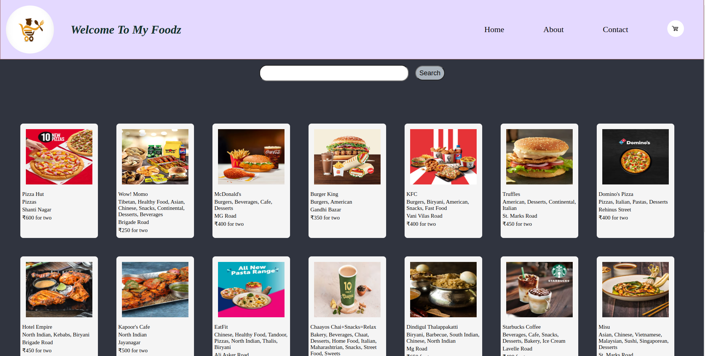

A Online Food Delivery Website Using React...

# website design
1. Header
    - logo 
    - navbar (links to other pages)
2. Body
    - SearchBar
    -RestaurantCards
3. Footer
    -copyright
    -contacts*/

# Config Driven UI
- The api that we fetch through swiggy.com is based on config driven UI that means the data is not same for other cities like if in Bengaluru there is 50% discount on KFC that doesn't mean other cities have same discount ...The data that come from backend the crousel(Rest.. Card Data) changed based on data that comes..

# img

# HOOKS
    (Normal JS utility Function)
  - useState() -- State Variable in react
  - useEffect()

  - useState is use to modify the variable by rendering the whole component (Body) again but it refresh the only part that seems changed using useState variable

  - useEffect is consisting of two parameters one is a function and a array(dependency list). 
  - useEffect will render the page after the initial component body is rendered.

# Shimmer UI
 - We create shimmer as a duplicate UI that renders first when website loads after that the fetched api renders data on page that replace shimmer.
 - In simple words it is we Loads fake page before load api datas.

 # react-router-dom
  - helps to render many pages through a link
  - In createbrowserrouter we add path of page and element that we have to shown on that page
  - outlet takes the element according to path that we select

 # Components
  - Function Based Components -- It is a funcn that returns a piece of jsx
  - Class Based Components -- It is a class which extends react.component and it has render() method to return a piece of jsx
  - React.Component come from by importing react
  - componentDidMount use for api calls in class based components
  - First constructor then return renders after that componentDidMount renders